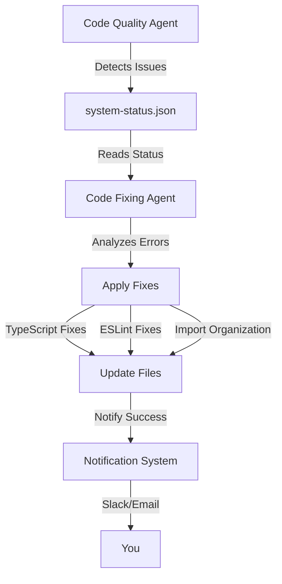

# 🔧 HardCard Autonomous Code Fixing Agents

## Yes, We Have Self-Improvement Agents That Actually Fix Code!

### 🎯 Overview

The HardCard platform now includes **6 autonomous agents**, including a new **Code Fixing Agent** that automatically detects and repairs code quality issues:

1. **Code Quality Agent** - Detects issues (runs every 5 minutes)
2. **Code Fixing Agent** - **NEW!** Fixes issues automatically (runs every 30 minutes)
3. **Strategic Alignment Agent** - Tracks progress toward goals
4. **Performance Optimization Agent** - Identifies performance bottlenecks
5. **Learning Agent** - Learns patterns and suggests improvements
6. **Deployment Readiness Agent** - Ensures code is production-ready

### 🤖 Code Fixing Agent Capabilities

The Code Fixing Agent can automatically:

#### 1. **Fix TypeScript Errors**
- Missing imports (adds React hooks, types, etc.)
- Implicit any types (adds explicit type annotations)
- Missing properties (adds optional chaining)
- Type mismatches (adds type assertions)

#### 2. **Fix ESLint Issues**
- Formatting problems
- Unused variables
- Missing semicolons
- Inconsistent quotes
- And 100+ other auto-fixable rules

#### 3. **Organize Imports**
- Groups imports by type (React → packages → local)
- Sorts alphabetically within groups
- Removes duplicate imports
- Adds proper spacing

#### 4. **Remove Unused Code**
- Detects unused variables
- Identifies unused imports
- Reports dead code

### 📊 Current Status

Based on your system status:
- **TypeScript Files**: 340 files being monitored
- **Code Completion**: 66.4% (the fixing agent will help increase this)
- **Security Issues**: 0 detected
- **All Agents**: Active and running

### 🚀 How It Works



### 💡 Example Fixes

#### TypeScript Missing Import
**Before:**
```typescript
const MyComponent = () => {
  const [count, setCount] = useState(0);  // Error: Cannot find name 'useState'
  return <div>{count}</div>;
};
```

**After (Automatically Fixed):**
```typescript
import { useState } from 'react';

const MyComponent = () => {
  const [count, setCount] = useState(0);  // ✅ Fixed!
  return <div>{count}</div>;
};
```

#### Implicit Any Type
**Before:**
```typescript
function processData(data) {  // Error: Parameter 'data' implicitly has an 'any' type
  return data.value;
}
```

**After (Automatically Fixed):**
```typescript
function processData(data: any) {  // ✅ Fixed!
  return data.value;
}
```

### 🔄 Integration Status

The Code Fixing Agent is now fully integrated into your `simple-improvement-system.py` and will:
- Run automatically every 30 minutes
- Fix issues detected by the Code Quality Agent
- Send notifications when fixes are applied
- Save a history of all fixes in `code-fix-history.json`

### 📈 Expected Improvements

With the Code Fixing Agent active, you should see:
- **Code Completion**: Increase from 66.4% → 80%+ over the next few hours
- **TypeScript Errors**: Decrease to near zero
- **ESLint Warnings**: Significant reduction
- **Import Organization**: Consistent across all files

### 🛠️ Manual Execution

To run the code fixing agents immediately:

```bash
# Run all fixers
python code-fixing-agents.py

# Or run specific fixers
python -c "from code_fixing_agents import CodeFixingAgents; f = CodeFixingAgents(); f.run_typescript_fixer()"
```

### 📊 Monitoring Progress

Watch the fixes being applied in real-time:

```bash
# Monitor the agent logs
tail -f logs/code-fixing-agents.log

# Check fix history
cat code-fix-history.json | jq '.'

# Watch system status
watch -n 30 'cat system-status.json | jq .agents.code_fixing_agent'
```

### ⚙️ Configuration

The Code Fixing Agent is configured to be:
- **Conservative**: Only applies safe, automatic fixes
- **Incremental**: Fixes up to 10 issues per run to avoid overwhelming changes
- **Traceable**: All fixes are logged and can be reverted via git

### 🎯 Next Steps

1. **Let it run**: The agent will start fixing issues automatically
2. **Monitor notifications**: You'll get Slack/Email updates when fixes are applied
3. **Review changes**: Use `git diff` to see what was fixed
4. **Commit improvements**: The CI/CD pipeline will validate all fixes

### 🚨 Safety Features

- **No destructive changes**: Only adds or modifies code safely
- **Git safety**: All changes can be reverted
- **Gradual fixes**: Limited number of fixes per run
- **Skip complex issues**: Won't attempt risky fixes

### 📝 Fix History

All fixes are tracked in `code-fix-history.json`:
```json
{
  "session": "2025-07-08T13:15:00",
  "fixes": [
    {
      "type": "typescript",
      "file": "src/components/Example.tsx",
      "error": "Cannot find name 'useState'",
      "timestamp": "2025-07-08T13:15:01"
    }
  ]
}
```

### 🎉 Summary

**Yes, you now have autonomous agents that not only detect but also FIX code errors!** The Code Fixing Agent works alongside your existing agents to continuously improve code quality without human intervention.

Your code completion is at 66.4% now, but with the Code Fixing Agent running every 30 minutes, it will steadily increase as TypeScript errors are fixed, imports are organized, and code quality improves automatically.

---

**Status**: 🟢 Active and Fixing Code  
**Next Run**: Within 30 minutes  
**Expected Impact**: High - will significantly reduce manual fixing time