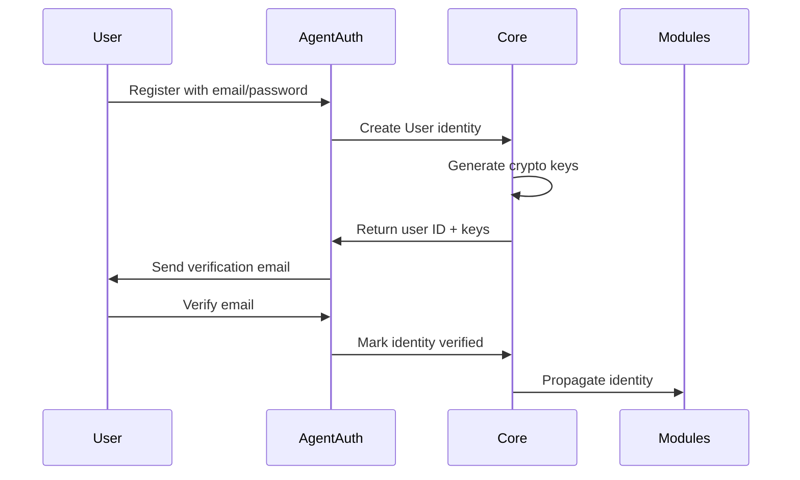
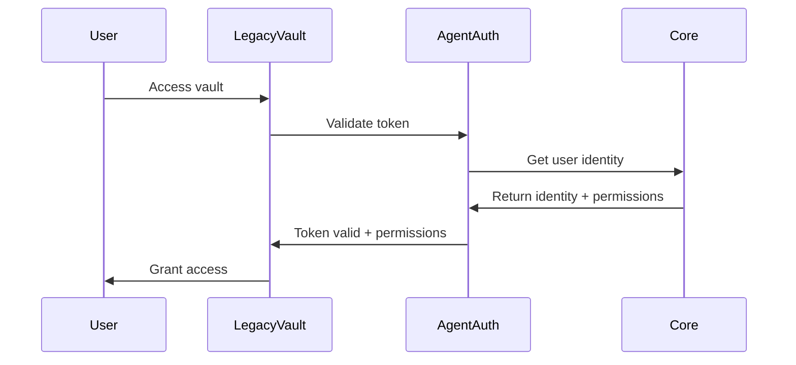
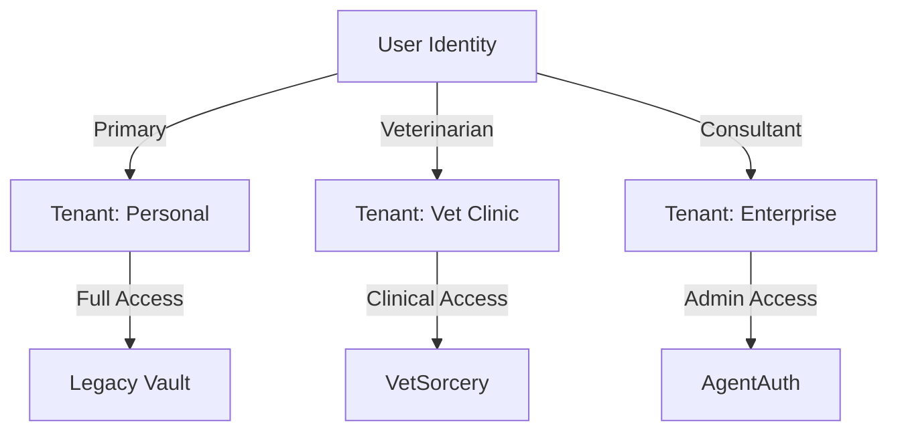

# HardCard Core Identity Schema

**Version:** 1.0  
**Status:** Draft  
**Last Updated:** 2025-01-07

## Overview

The HardCard Core Identity Schema defines the unified identity model used across all HardCard modules. This schema enables seamless authentication, authorization, and data sharing between Legacy Vault, VetSorcery, AgentAuth, and future modules.

## Design Principles

1. **Unified Identity**: Single identity across all modules
2. **Privacy by Design**: Minimal data exposure, user-controlled sharing
3. **Multi-Tenant**: Support for multiple organizations per user
4. **Extensible**: Easy to add new attributes and relationships
5. **Audit-Ready**: Every change tracked for compliance
6. **Cryptographically Secure**: All sensitive data encrypted at rest

## Core Identity Model

### User Identity

```yaml
User:
  id: UUID
  type: "individual" | "organization" | "service"
  
  # Core Identifiers
  identifiers:
    primary_email: String (encrypted, unique)
    username: String (unique, case-insensitive)
    phone_number: String (encrypted, E.164 format)
    
  # Authentication
  auth:
    password_hash: String (Argon2id)
    mfa_secret: String (encrypted)
    backup_codes: Array<String> (encrypted)
    webauthn_credentials: Array<WebAuthnCredential>
    
  # Profile
  profile:
    display_name: String
    given_name: String (encrypted)
    family_name: String (encrypted)
    preferred_language: String (ISO 639-1)
    timezone: String (IANA timezone)
    avatar_url: String
    
  # Security
  security:
    created_at: DateTime
    updated_at: DateTime
    last_login_at: DateTime
    last_password_change: DateTime
    failed_login_attempts: Integer
    locked_until: DateTime (nullable)
    
  # Compliance
  compliance:
    terms_accepted_at: DateTime
    privacy_accepted_at: DateTime
    marketing_consent: Boolean
    data_retention_preference: "minimum" | "standard" | "maximum"
    gdpr_data_export_requests: Array<DataExportRequest>
    
  # Status
  status:
    is_active: Boolean
    is_verified: Boolean
    is_deleted: Boolean (soft delete)
    deleted_at: DateTime (nullable)
    deletion_reason: String (nullable)
```

### Multi-Tenant Membership

```yaml
TenantMembership:
  id: UUID
  user_id: UUID (references User)
  tenant_id: UUID (references Tenant)
  
  # Membership Details
  membership:
    roles: Array<String>
    permissions: Array<String> (computed)
    joined_at: DateTime
    invited_by: UUID (references User)
    invitation_accepted_at: DateTime
    
  # Status
  status:
    is_active: Boolean
    is_primary: Boolean (one per user)
    suspended_until: DateTime (nullable)
    suspension_reason: String (nullable)
    
  # Module Access
  module_access:
    legacy_vault:
      enabled: Boolean
      roles: Array<String>
      storage_quota_gb: Integer
      
    vetsorcery:
      enabled: Boolean
      roles: Array<"veterinarian" | "technician" | "receptionist" | "admin">
      license_number: String (encrypted)
      specializations: Array<String>
      
    agentauth:
      enabled: Boolean
      api_access: Boolean
      rate_limit_tier: "basic" | "professional" | "enterprise"
```

### Tenant (Organization)

```yaml
Tenant:
  id: UUID
  type: "personal" | "clinic" | "hospital" | "enterprise"
  
  # Identity
  identity:
    name: String
    legal_name: String (encrypted)
    tax_id: String (encrypted)
    
  # Contact
  contact:
    primary_email: String
    phone: String
    website: String
    
  # Address
  address:
    street: String (encrypted)
    city: String
    state_province: String
    postal_code: String
    country: String (ISO 3166-1)
    
  # Billing
  billing:
    stripe_customer_id: String (encrypted)
    billing_email: String
    payment_method: "card" | "ach" | "invoice"
    subscription_tier: "free" | "starter" | "professional" | "enterprise"
    
  # Settings
  settings:
    branding:
      logo_url: String
      primary_color: String
      
    security:
      require_mfa: Boolean
      allowed_ip_ranges: Array<String>
      session_timeout_minutes: Integer
      
    compliance:
      industry: "healthcare" | "financial" | "general"
      regulations: Array<"hipaa" | "gdpr" | "sox" | "pci">
```

### Cryptographic Keys

```yaml
CryptoKey:
  id: UUID
  owner_id: UUID (references User or Tenant)
  owner_type: "user" | "tenant"
  
  # Key Details
  key:
    type: "signing" | "encryption" | "wallet" | "recovery"
    algorithm: String
    public_key: String
    private_key_encrypted: String (encrypted with user's master key)
    key_derivation_path: String (for HD wallets)
    
  # Metadata
  metadata:
    name: String
    description: String
    created_at: DateTime
    last_used_at: DateTime
    expires_at: DateTime (nullable)
    
  # Security
  security:
    requires_mfa: Boolean
    requires_approval: Boolean
    approved_by: Array<UUID> (references User)
    revoked_at: DateTime (nullable)
    revocation_reason: String (nullable)
```

### Identity Verification

```yaml
IdentityVerification:
  id: UUID
  user_id: UUID (references User)
  
  # Verification Details
  verification:
    type: "email" | "phone" | "document" | "biometric" | "blockchain"
    status: "pending" | "verified" | "failed" | "expired"
    
  # Evidence
  evidence:
    email_verification:
      email: String
      token_sent_at: DateTime
      verified_at: DateTime
      
    phone_verification:
      phone_number: String
      code_sent_at: DateTime
      verified_at: DateTime
      
    document_verification:
      document_type: "passport" | "drivers_license" | "national_id"
      document_number_hash: String
      issuing_country: String
      expiry_date: Date
      verified_at: DateTime
      verification_service: String
      
    biometric_verification:
      type: "face" | "fingerprint"
      template_hash: String
      confidence_score: Float
      verified_at: DateTime
      
    blockchain_verification:
      chain: "ethereum" | "bitcoin" | "polygon"
      address: String
      signature: String
      message: String
      verified_at: DateTime
```

### Cross-Module Identity Linking

```yaml
ModuleIdentity:
  id: UUID
  user_id: UUID (references User)
  module: "legacy_vault" | "vetsorcery" | "agentauth"
  
  # Module-Specific ID
  module_user_id: String (module's internal user ID)
  
  # Sync Status
  sync:
    last_synced_at: DateTime
    sync_enabled: Boolean
    sync_fields: Array<String>
    
  # Data Sharing
  sharing:
    shared_with_modules: Array<String>
    sharing_permissions: Map<String, Array<String>>
```

## Data Flow

### 1. User Registration Flow


### 2. Cross-Module Authentication


### 3. Multi-Tenant Access


## Security Considerations

### Encryption
- **At Rest**: AES-256-GCM for all sensitive fields
- **In Transit**: TLS 1.3 minimum
- **Key Management**: Hardware Security Module (HSM) for production
- **Key Rotation**: Automatic rotation every 90 days

### Access Control
- **Zero Trust**: Every request authenticated and authorized
- **Principle of Least Privilege**: Minimal permissions by default
- **Tenant Isolation**: Complete data segregation
- **Audit Trail**: Every access logged with context

### Privacy
- **Data Minimization**: Only collect necessary data
- **Purpose Limitation**: Data used only for stated purposes
- **User Control**: Users can view, export, and delete their data
- **Encryption by Default**: All PII encrypted

## Implementation Guidelines

### Database Schema
```sql
-- Core user table
CREATE TABLE users (
    id UUID PRIMARY KEY DEFAULT uuid_generate_v4(),
    type VARCHAR(20) NOT NULL CHECK (type IN ('individual', 'organization', 'service')),
    primary_email_encrypted TEXT NOT NULL,
    primary_email_hash VARCHAR(64) UNIQUE NOT NULL, -- For lookups
    username VARCHAR(255) UNIQUE NOT NULL,
    created_at TIMESTAMPTZ NOT NULL DEFAULT CURRENT_TIMESTAMP,
    updated_at TIMESTAMPTZ NOT NULL DEFAULT CURRENT_TIMESTAMP
);

-- Tenant memberships
CREATE TABLE tenant_memberships (
    id UUID PRIMARY KEY DEFAULT uuid_generate_v4(),
    user_id UUID NOT NULL REFERENCES users(id),
    tenant_id UUID NOT NULL REFERENCES tenants(id),
    roles TEXT[] NOT NULL DEFAULT '{}',
    is_primary BOOLEAN NOT NULL DEFAULT false,
    joined_at TIMESTAMPTZ NOT NULL DEFAULT CURRENT_TIMESTAMP,
    UNIQUE(user_id, tenant_id)
);

-- Crypto keys
CREATE TABLE crypto_keys (
    id UUID PRIMARY KEY DEFAULT uuid_generate_v4(),
    owner_id UUID NOT NULL,
    owner_type VARCHAR(20) NOT NULL CHECK (owner_type IN ('user', 'tenant')),
    key_type VARCHAR(20) NOT NULL,
    public_key TEXT NOT NULL,
    private_key_encrypted TEXT,
    created_at TIMESTAMPTZ NOT NULL DEFAULT CURRENT_TIMESTAMP,
    expires_at TIMESTAMPTZ,
    revoked_at TIMESTAMPTZ
);

-- Indexes for performance
CREATE INDEX idx_users_username ON users(username);
CREATE INDEX idx_users_email_hash ON users(primary_email_hash);
CREATE INDEX idx_tenant_memberships_user ON tenant_memberships(user_id);
CREATE INDEX idx_tenant_memberships_tenant ON tenant_memberships(tenant_id);
CREATE INDEX idx_crypto_keys_owner ON crypto_keys(owner_id, owner_type);
```

### API Endpoints
```yaml
# User Management
GET    /api/v1/users/me
PUT    /api/v1/users/me
DELETE /api/v1/users/me

# Tenant Management  
GET    /api/v1/tenants
POST   /api/v1/tenants
GET    /api/v1/tenants/{tenant_id}
PUT    /api/v1/tenants/{tenant_id}

# Identity Verification
POST   /api/v1/verify/email
POST   /api/v1/verify/phone
POST   /api/v1/verify/document
GET    /api/v1/verify/status

# Cross-Module
GET    /api/v1/modules/identities
POST   /api/v1/modules/link
DELETE /api/v1/modules/link/{module}
```

## Migration Strategy

### Phase 1: AgentAuth Integration
1. Implement core identity schema in AgentAuth
2. Migrate existing users to new schema
3. Update authentication flows

### Phase 2: Legacy Vault Integration
1. Link vault users to core identities
2. Migrate permissions to unified model
3. Enable cross-module authentication

### Phase 3: VetSorcery Integration
1. Map clinic staff to core identities
2. Implement role-based access
3. Enable patient data sharing controls

### Phase 4: Full Integration
1. Enable seamless module switching
2. Implement unified billing
3. Launch identity dashboard

## Compliance Mappings

### GDPR
- **Right to Access**: Export all user data via API
- **Right to Erasure**: Soft delete with crypto shredding
- **Data Portability**: JSON/CSV export formats
- **Consent Management**: Granular consent tracking

### HIPAA
- **Access Controls**: Role-based with audit trail
- **Encryption**: PHI encrypted at rest and in transit
- **Audit Logs**: Comprehensive access logging
- **Data Integrity**: Cryptographic signatures

### SOX
- **Segregation of Duties**: Role separation enforced
- **Change Management**: All changes tracked
- **Access Certification**: Periodic access reviews
- **Audit Trail**: Immutable audit logs

## Future Enhancements

1. **Decentralized Identity**: Support for DID/Verifiable Credentials
2. **Biometric Authentication**: Face/fingerprint for mobile
3. **Social Recovery**: Recover account via trusted contacts
4. **Zero-Knowledge Proofs**: Prove attributes without revealing data
5. **Federated Identity**: Support for SAML/OIDC providers