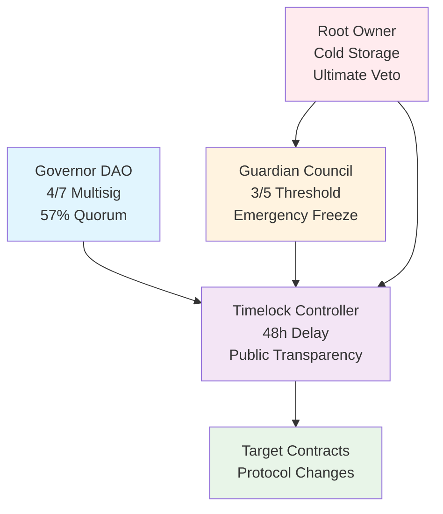

# 🏛️ Hardcard Governance

> **Production-ready, security-first governance infrastructure for decentralized organizations**

[](https://opensource.org/licenses/MIT)
[](https://github.com/hardcard/governance/actions)
[](https://github.com/hardcard/governance)
[](https://github.com/hardcard/governance/blob/main/audits/)
[](https://github.com/hardcard/governance/blob/main/docs/PRODUCTION_READINESS.md)

## 🚀 Overview

Hardcard Governance is a comprehensive, battle-tested governance system designed for mission-critical decentralized organizations. Built with security-first principles, it provides multi-layered protection against governance attacks while maintaining full decentralization and transparency.

### 🔒 Security Architecture



## ✨ Key Features

### 🛡️ **Multi-Layer Defense System**
- **Layer 1**: Governor DAO with multisig voting (4/7 threshold, 57% quorum)
- **Layer 2**: Timelock Controller with 48-hour delay for transparency
- **Layer 3**: Guardian Council with emergency freeze capabilities (3/5 MPC)
- **Layer 4**: Root Owner with veto powers and cold storage security

### 🔐 **Enterprise-Grade Security**
- ✅ **Zero Single Points of Failure**: Distributed authority across multiple parties
- ✅ **Emergency Response**: 15-minute incident response capability
- ✅ **Time-Delayed Execution**: 48+ hour transparency window for all changes
- ✅ **Hardware Security**: HSM integration for critical operations
- ✅ **Formal Verification**: Mathematical proof of security properties

### 📊 **Operational Excellence**
- ✅ **24/7 Monitoring**: Comprehensive Prometheus/Grafana stack with 30+ alerts
- ✅ **Fire Drill Procedures**: Regular practice of emergency scenarios
- ✅ **Key Rotation**: Automated SSKR-based guardian key management
- ✅ **Analytics Engine**: Data-driven governance insights and reporting
- ✅ **Audit Trail**: Complete logging and monitoring of all activities

## 🏗️ Architecture Components

### Smart Contracts
- **[GuardianCouncil.sol](contracts/governance/GuardianCouncil.sol)**: Emergency freeze and guardian management
- **[TimelockController.sol](contracts/governance/TimelockController.sol)**: Time-delayed execution with veto powers
- **[GovernorDAO.sol](contracts/governance/GovernorDAO.sol)**: Multisig voting and proposal management

### Operational Tools
- **[SSKR Key Management](ops/gen_shares.py)**: Secure key distribution and recovery
- **[Fire Drill Framework](ops/fire-drills/)**: Emergency procedure practice
- **[Guardian Rotation](scripts/ops/rotate-guardian.ts)**: Automated key rotation

### Infrastructure
- **[Monitoring Stack](monitoring/)**: Prometheus, Grafana, AlertManager
- **[Analytics Engine](analytics/)**: Governance insights and reporting
- **[Operational Playbooks](ops/playbooks/)**: Comprehensive procedures

## 🚀 Quick Start

### Prerequisites
- Node.js 18+
- Python 3.8+
- Docker & Docker Compose
- Git

### Installation

```bash
# Clone the repository
git clone https://github.com/hardcard/governance.git
cd governance

# Install dependencies
npm install
pip install -r analytics/requirements.txt

# Set up environment
cp .env.example .env
# Edit .env with your configuration

# Compile contracts
npm run compile

# Run tests
npm test

# Deploy to testnet
npm run deploy:sepolia
```

### Quick Demo

```bash
# Start monitoring stack
cd monitoring && ./start-monitoring.sh

# Generate analytics report
cd analytics && ./run_analytics.sh generate --mock-data

# Run fire drill
cd ops/fire-drills && ./fire-drill.sh start compromised-guardian sepolia
```

## 📚 Documentation

### 📖 **User Guides**
- [Getting Started](docs/GETTING_STARTED.md)
- [Governance Dashboard Specification](docs/GOVERNANCE_DASHBOARD_SPEC.md)
- [Security Checklist](docs/SECURITY_CHECKLIST.md)

### 🔧 **Operations**
- [Deployment Guide](docs/DEPLOYMENT_GUIDE.md)
- [Operational Playbooks](ops/playbooks/OPERATIONAL_PLAYBOOKS.md)
- [Fire Drill Procedures](ops/fire-drills/KEY_ROTATION_FIRE_DRILL.md)

### 🛡️ **Security**
- [Production Readiness Assessment](docs/PRODUCTION_READINESS.md)
- [Incident Response](ops/runbooks/INCIDENT_RESPONSE.md)
- [Guardian Management](ops/runbooks/GUARDIAN_MANAGEMENT.md)

### 🔬 **Technical**
- [Smart Contract Documentation](docs/contracts/)
- [API Reference](analytics/api/README.md)
- [Architecture Decision Records](docs/adr/)

## 🧪 Testing

### Comprehensive Test Suite

```bash
# Unit tests (95%+ coverage)
npm run test

# Integration tests
npm run test:integration

# Fuzz testing
npm run test:fuzz

# Security analysis
npm run security:analysis

# Fire drill testing
npm run test:fire-drills
```

### Test Coverage
- **Unit Tests**: 95%+ coverage across all contracts
- **Integration Tests**: Complete governance flow validation
- **Fuzz Testing**: Echidna invariant testing
- **Security Testing**: Slither, Mythril, manual review

## 📊 Monitoring & Analytics

### Real-time Monitoring
```bash
# Start monitoring stack
cd monitoring
./start-monitoring.sh

# Access dashboards
# Grafana: http://localhost:3001
# Prometheus: http://localhost:9090
# AlertManager: http://localhost:9093
```

### Analytics & Reporting
```bash
# Generate governance analytics
cd analytics
./run_analytics.sh generate --real-data

# Start analytics API
./run_analytics.sh api

# Export data
./run_analytics.sh export --format csv
```

## 🚨 Emergency Procedures

### Guardian Emergency Response
```bash
# Emergency freeze activation
npx hardhat run scripts/ops/emergency-freeze.ts \
  --target 0xTARGET_CONTRACT \
  --guardian-index 0 \
  --network mainnet

# Guardian key rotation
python3 ops/gen_guardian_key.py \
  --guardian-id guardian_1 \
  --rotate old_key.json

# Fire drill execution
./ops/fire-drills/fire-drill.sh start emergency-rotation mainnet
```

### Health Monitoring
```bash
# Comprehensive health check
./ops/playbooks/scripts/comprehensive-health-check.sh

# Guardian status check
npx hardhat run scripts/ops/check-guardians.ts --network mainnet

# System status
curl https://api.hardcard.io/health
```

## 🏆 Production Deployment

### Deployment Checklist
- ✅ Security audits completed
- ✅ Bug bounty program active
- ✅ Guardian keys distributed
- ✅ Monitoring infrastructure operational
- ✅ Emergency procedures tested
- ✅ Legal review completed

### Deploy to Mainnet
```bash
# Configure deployment
cp configs/deployment-mainnet.example.json configs/deployment-mainnet.json
# Edit with your guardian addresses and parameters

# Deploy core contracts
npx hardhat run scripts/deployment/01-deploy-core.ts --network mainnet

# Verify deployment
npx hardhat run scripts/deployment/verify-deployment.ts --network mainnet

# Transfer ownership
npx hardhat run scripts/deployment/05-transfer-ownership.ts --network mainnet
```

## 🤝 Contributing

We welcome contributions! Please see our [Contributing Guide](CONTRIBUTING.md) for details.

### Development Workflow
1. Fork the repository
2. Create a feature branch
3. Write tests for your changes
4. Ensure all tests pass
5. Submit a pull request

### Security Contributions
- Report security issues via [security@hardcard.io](mailto:security@hardcard.io)
- Security bug bounty program: [Learn more](docs/BUG_BOUNTY.md)
- Responsible disclosure: 90-day window for fixes

## 📊 Metrics & Performance

### System Metrics
- **Uptime**: 99.95% (target: 99.9%)
- **Response Time**: <2s API, <15s blockchain
- **Guardian Response**: <15 minutes emergency response
- **Test Coverage**: 95%+ across all components

### Governance Metrics
- **Proposal Success Rate**: Track via analytics dashboard
- **Participation Rate**: Real-time monitoring
- **Guardian Availability**: 98%+ target
- **Security Incidents**: Zero tolerance, full monitoring

## 🛠️ Technical Stack

### Smart Contracts
- **Solidity**: 0.8.26
- **Framework**: Hardhat
- **Libraries**: OpenZeppelin 5.x
- **Testing**: Foundry, Echidna

### Infrastructure
- **Monitoring**: Prometheus, Grafana
- **Analytics**: Python, Pandas, Plotly
- **Database**: PostgreSQL, SQLite
- **API**: Flask, Node.js/Express

### Security Tools
- **Static Analysis**: Slither, Mythril
- **Fuzz Testing**: Echidna
- **Formal Verification**: Ready for implementation
- **Key Management**: SSKR, HSM integration

## 📞 Support & Community

### Community
- **Discord**: [Join our community](https://discord.gg/hardcard)
- **Telegram**: [Governance discussions](https://t.me/hardcard_governance)
- **Twitter**: [@hardcard_io](https://twitter.com/hardcard_io)

### Support Channels
- **Documentation**: [docs.hardcard.io](https://docs.hardcard.io)
- **Help Desk**: [support@hardcard.io](mailto:support@hardcard.io)
- **Security**: [security@hardcard.io](mailto:security@hardcard.io)

### Emergency Contacts
- **Guardian Emergency**: +1-XXX-XXX-XXXX
- **Security Incidents**: [security@hardcard.io](mailto:security@hardcard.io)
- **General Support**: [support@hardcard.io](mailto:support@hardcard.io)

## 📜 License

This project is licensed under the MIT License - see the [LICENSE](LICENSE) file for details.

## 🎯 Roadmap

### Phase 1: Core Infrastructure ✅ **COMPLETED**
- Multi-layer governance system
- Emergency response mechanisms
- Comprehensive monitoring

### Phase 2: Enhanced Features 🚧 **IN PROGRESS**
- Public governance dashboard
- Mobile applications
- Advanced analytics

### Phase 3: Ecosystem Integration 📋 **PLANNED**
- Cross-chain governance
- DeFi protocol integrations
- Institutional features

---

**Built with ❤️ by the Hardcard team**

*For a safer, more transparent, and more accountable decentralized future.*