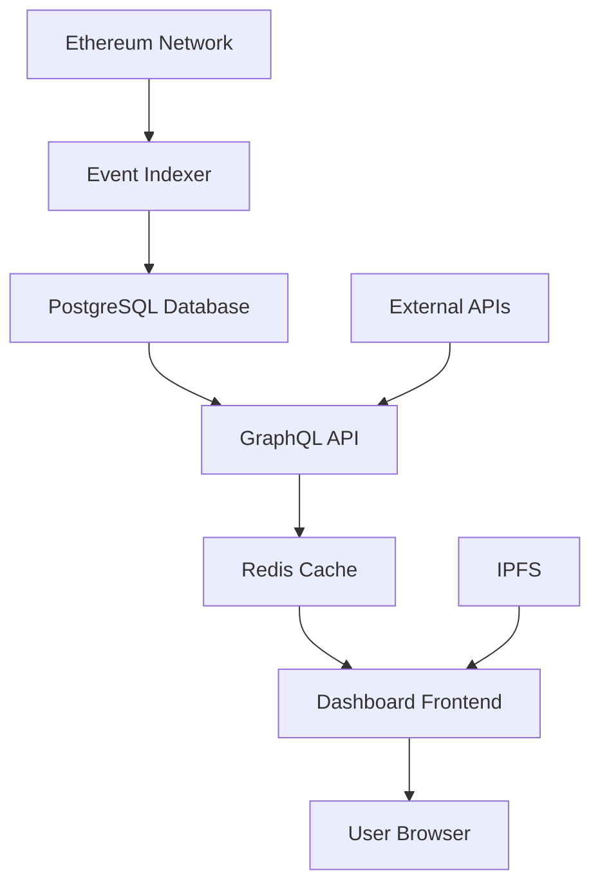

# 📊 Hardcard Governance Dashboard Specification

**Version**: 1.0  
**Last Updated**: 2025-06-28  
**Purpose**: Public transparency dashboard for governance activities  
**Audience**: Community members, token holders, auditors

---

## 🎯 Dashboard Objectives

### Primary Goals
1. **Transparency**: Provide complete visibility into governance operations
2. **Accessibility**: Make governance data easily understandable for all users
3. **Real-time Updates**: Show current status and recent activities
4. **Trust Building**: Demonstrate system security and proper operation
5. **Participation**: Encourage informed community engagement

### Success Metrics
- **Engagement**: 80%+ of governance participants use dashboard
- **Comprehension**: 90%+ users understand proposal status
- **Trust**: Measurable increase in governance participation
- **Performance**: < 3 second load times, 99.9% uptime

---

## 🏗️ Architecture Overview

### Technology Stack
```
Frontend: React/Next.js + TypeScript
Styling: Tailwind CSS + shadcn/ui
Charts: Recharts + D3.js
Data: GraphQL + Apollo Client
Backend: Node.js + Express
Database: PostgreSQL + Redis (cache)
Indexing: Custom event indexer
Hosting: Vercel (frontend) + Railway (backend)
```

### Data Flow


---

## 📱 User Interface Design

### Layout Structure
```
Header: Logo | Navigation | Network Status | Search
Sidebar: Quick Stats | Recent Activity | Alerts
Main: Dynamic content based on current view
Footer: Links | Social | API Status
```

### Color Scheme
```scss
// Brand Colors
$primary: #6366f1;      // Indigo - Primary actions
$secondary: #8b5cf6;    // Purple - Secondary elements  
$accent: #06b6d4;       // Cyan - Highlights

// Status Colors
$success: #10b981;      // Green - Passed/Active
$warning: #f59e0b;      // Amber - Pending/Warning
$danger: #ef4444;       // Red - Failed/Critical
$info: #3b82f6;         // Blue - Information

// Neutral Colors
$background: #f8fafc;   // Light gray background
$surface: #ffffff;      // White cards/surfaces
$border: #e2e8f0;       // Light borders
$text-primary: #1e293b; // Dark text
$text-secondary: #64748b; // Medium text
```

---

## 📊 Dashboard Pages

### 1. Overview Page (`/`)
**Purpose**: High-level governance system status

#### Components
- **System Health Widget**
  ```typescript
  interface SystemHealth {
    status: 'healthy' | 'warning' | 'critical';
    guardianCount: number;
    threshold: number;
    lastActivity: Date;
    networkStatus: NetworkStatus;
  }
  ```

- **Active Proposals Card**
  ```typescript
  interface ActiveProposal {
    id: string;
    title: string;
    state: ProposalState;
    votesFor: BigNumber;
    votesAgainst: BigNumber;
    deadline: Date;
    quorumReached: boolean;
  }
  ```

- **Recent Activity Timeline**
  ```typescript
  interface Activity {
    id: string;
    type: 'proposal_created' | 'vote_cast' | 'guardian_action';
    timestamp: Date;
    description: string;
    transactionHash: string;
    blockNumber: number;
  }
  ```

- **Governance Stats Grid**
  ```typescript
  interface GovernanceStats {
    totalProposals: number;
    successRate: number;
    avgVotingPower: number;
    participationRate: number;
    treasuryValue: BigNumber;
  }
  ```

#### Layout
```jsx
<div className="grid grid-cols-12 gap-6">
  <div className="col-span-12 lg:col-span-8">
    <SystemHealthWidget />
    <ActiveProposalsCard />
  </div>
  <div className="col-span-12 lg:col-span-4">
    <GovernanceStatsGrid />
    <RecentActivityTimeline />
  </div>
</div>
```

### 2. Proposals Page (`/proposals`)
**Purpose**: Comprehensive proposal management interface

#### Components
- **Proposal List Table**
  ```typescript
  interface ProposalListItem {
    id: string;
    title: string;
    proposer: string;
    state: ProposalState;
    created: Date;
    deadline: Date;
    votingPower: {
      for: BigNumber;
      against: BigNumber;
      abstain: BigNumber;
    };
    quorum: {
      required: number;
      current: number;
      percentage: number;
    };
  }
  ```

- **Proposal Filters**
  ```typescript
  interface ProposalFilters {
    state?: ProposalState[];
    dateRange?: [Date, Date];
    proposer?: string;
    search?: string;
    sortBy: 'created' | 'deadline' | 'votes';
    sortOrder: 'asc' | 'desc';
  }
  ```

- **Proposal Details Modal**
  ```typescript
  interface ProposalDetails {
    id: string;
    title: string;
    description: string;
    proposer: string;
    targets: string[];
    values: BigNumber[];
    calldatas: string[];
    created: Date;
    startBlock: number;
    endBlock: number;
    votes: Vote[];
    timeline: ProposalEvent[];
  }
  ```

#### Features
- Real-time voting updates
- Proposal state visualization
- Vote breakdown charts
- Timeline progression
- Impact analysis

### 3. Guardians Page (`/guardians`)
**Purpose**: Guardian Council monitoring and transparency

#### Components
- **Guardian Overview Grid**
  ```typescript
  interface Guardian {
    address: string;
    name?: string;
    status: 'active' | 'inactive';
    joinedDate: Date;
    lastActivity: Date;
    actionsCount: number;
    reputation: number;
  }
  ```

- **Guardian Actions History**
  ```typescript
  interface GuardianAction {
    guardian: string;
    action: 'freeze' | 'unfreeze' | 'vote';
    target?: string;
    timestamp: Date;
    transactionHash: string;
    success: boolean;
  }
  ```

- **Emergency Status Panel**
  ```typescript
  interface EmergencyStatus {
    isEmergency: boolean;
    activeFreeze?: {
      target: string;
      startTime: Date;
      endTime: Date;
      initiatedBy: string[];
    };
    pendingActions: GuardianAction[];
  }
  ```

- **Threshold Visualization**
  ```jsx
  <div className="flex items-center space-x-2">
    <div className="flex space-x-1">
      {guardians.map((guardian, i) => (
        <div
          key={i}
          className={`w-8 h-8 rounded-full ${
            guardian.status === 'active' 
              ? 'bg-green-500' 
              : 'bg-gray-300'
          }`}
        />
      ))}
    </div>
    <span>{activeGuardians}/{totalGuardians} active</span>
    <span>({threshold} required)</span>
  </div>
  ```

### 4. Analytics Page (`/analytics`)
**Purpose**: Deep insights into governance performance

#### Components
- **Participation Trends Chart**
  ```typescript
  interface ParticipationData {
    date: Date;
    uniqueVoters: number;
    totalVotes: number;
    quorumReached: boolean;
    proposalCount: number;
  }
  ```

- **Vote Distribution Analysis**
  ```typescript
  interface VoteDistribution {
    proposal: string;
    distribution: {
      for: { count: number; percentage: number; power: BigNumber };
      against: { count: number; percentage: number; power: BigNumber };
      abstain: { count: number; percentage: number; power: BigNumber };
    };
    demographics: {
      whales: number; // > 10% voting power
      dolphins: number; // 1-10% voting power  
      minnows: number; // < 1% voting power
    };
  }
  ```

- **System Performance Metrics**
  ```typescript
  interface PerformanceMetrics {
    avgProposalDuration: number;
    avgVotingPeriod: number;
    successRate: number;
    participationRate: number;
    gasEfficiency: {
      avgGasPerVote: number;
      avgGasPerProposal: number;
    };
  }
  ```

- **Treasury Analytics**
  ```typescript
  interface TreasuryData {
    currentValue: BigNumber;
    history: TreasurySnapshot[];
    allocations: {
      category: string;
      amount: BigNumber;
      percentage: number;
    }[];
    projections: {
      runway: number; // months
      burnRate: BigNumber;
    };
  }
  ```

### 5. Documentation Page (`/docs`)
**Purpose**: Educational resources and API documentation

#### Sections
- **How Governance Works**: Visual guides and explanations
- **API Reference**: GraphQL schema and examples
- **Integration Guides**: For developers and partners  
- **FAQ**: Common questions and answers
- **Security**: Audit reports and security measures

---

## 🔌 API Specification

### GraphQL Schema
```graphql
type Query {
  # Proposals
  proposals(
    filter: ProposalFilter
    pagination: Pagination
  ): [Proposal!]!
  
  proposal(id: ID!): Proposal
  
  # Guardians
  guardians: [Guardian!]!
  guardianActions(
    guardian: String
    limit: Int
  ): [GuardianAction!]!
  
  # Analytics
  governanceStats: GovernanceStats!
  participationTrends(
    startDate: Date!
    endDate: Date!
  ): [ParticipationData!]!
  
  # System
  systemHealth: SystemHealth!
  networkStatus: NetworkStatus!
}

type Proposal {
  id: ID!
  title: String!
  description: String!
  proposer: String!
  state: ProposalState!
  created: Date!
  startBlock: Int!
  endBlock: Int!
  deadline: Date!
  
  targets: [String!]!
  values: [String!]! # BigNumber as string
  calldatas: [String!]!
  
  votes: ProposalVotes!
  quorum: QuorumInfo!
  timeline: [ProposalEvent!]!
  
  transactionHash: String!
  blockNumber: Int!
}

type ProposalVotes {
  for: String! # BigNumber as string
  against: String!
  abstain: String!
  total: String!
  
  voterCount: Int!
  breakdown: [VoteBreakdown!]!
}

type Guardian {
  address: String!
  name: String
  status: GuardianStatus!
  joinedDate: Date!
  lastActivity: Date
  actionsCount: Int!
  
  actions(limit: Int): [GuardianAction!]!
}

type SystemHealth {
  status: HealthStatus!
  guardianCount: Int!
  threshold: Int!
  lastActivity: Date
  networkStatus: NetworkStatus!
  emergencyStatus: EmergencyStatus
}

enum ProposalState {
  PENDING
  ACTIVE
  CANCELED
  DEFEATED
  SUCCEEDED
  QUEUED
  EXPIRED
  EXECUTED
}

enum GuardianStatus {
  ACTIVE
  INACTIVE
  PENDING
}

enum HealthStatus {
  HEALTHY
  WARNING
  CRITICAL
}
```

### REST API Endpoints
```typescript
// Health and Status
GET /api/health
GET /api/status
GET /api/network

// Proposals
GET /api/proposals
GET /api/proposals/:id
GET /api/proposals/:id/votes
GET /api/proposals/:id/timeline

// Guardians
GET /api/guardians
GET /api/guardians/:address
GET /api/guardians/actions

// Analytics
GET /api/analytics/overview
GET /api/analytics/participation
GET /api/analytics/performance

// Real-time subscriptions (WebSocket)
WS /api/subscribe/proposals
WS /api/subscribe/guardians
WS /api/subscribe/system
```

---

## 🔄 Real-time Features

### WebSocket Subscriptions
```typescript
// Proposal updates
interface ProposalUpdate {
  type: 'vote_cast' | 'state_change' | 'created';
  proposalId: string;
  data: any;
  timestamp: Date;
}

// System alerts
interface SystemAlert {
  type: 'guardian_action' | 'emergency' | 'network_issue';
  severity: 'info' | 'warning' | 'critical';
  message: string;
  timestamp: Date;
  metadata?: any;
}
```

### Push Notifications
```typescript
interface NotificationSettings {
  proposalUpdates: boolean;
  votingReminders: boolean;
  emergencyAlerts: boolean;
  systemMaintenance: boolean;
}

interface PushNotification {
  title: string;
  body: string;
  icon?: string;
  badge?: string;
  actions?: NotificationAction[];
  data?: any;
}
```

---

## 📱 Mobile Responsiveness

### Breakpoints
```scss
$breakpoints: (
  sm: 640px,   // Mobile landscape
  md: 768px,   // Tablet portrait
  lg: 1024px,  // Tablet landscape
  xl: 1280px,  // Desktop
  2xl: 1536px  // Large desktop
);
```

### Mobile-First Components
- Collapsible navigation
- Touch-friendly voting interface
- Responsive data tables
- Swipe gestures for timeline
- Optimized chart rendering

---

## ⚡ Performance Optimization

### Frontend Optimization
- **Code Splitting**: Route-based and component-based splitting
- **Lazy Loading**: Images, charts, and non-critical components
- **Caching**: Service worker for offline functionality
- **Bundle Size**: Target < 500KB initial bundle

### Backend Optimization
- **Database Indexing**: Optimized queries for all dashboard data
- **Redis Caching**: Cache frequently accessed data (5-minute TTL)
- **Connection Pooling**: Efficient database connections
- **Rate Limiting**: API protection and fair usage

### CDN Strategy
```typescript
const cdnConfig = {
  static: 'https://cdn.hardcard.io/dashboard/',
  images: 'https://images.hardcard.io/',
  api: 'https://api.hardcard.io/governance/',
  websocket: 'wss://ws.hardcard.io/governance/'
};
```

---

## 🔒 Security Measures

### Authentication & Authorization
- **Read-Only Public Access**: No authentication required for viewing
- **Optional Account Linking**: Connect wallet for personalized features
- **Rate Limiting**: Prevent abuse and ensure fair access
- **Input Validation**: Sanitize all user inputs

### Data Privacy
- **No PII Collection**: Only public blockchain data
- **Analytics Anonymization**: User behavior tracking without identification
- **GDPR Compliance**: Right to be forgotten for optional accounts
- **Cookie Policy**: Minimal, essential cookies only

### Security Headers
```typescript
const securityHeaders = {
  'Content-Security-Policy': "default-src 'self'; script-src 'self' 'unsafe-inline'",
  'X-Frame-Options': 'DENY',
  'X-Content-Type-Options': 'nosniff',
  'Referrer-Policy': 'strict-origin-when-cross-origin',
  'Permissions-Policy': 'camera=(), microphone=(), geolocation=()'
};
```

---

## 🧪 Testing Strategy

### Frontend Testing
```typescript
// Component testing with React Testing Library
describe('ProposalCard', () => {
  it('displays proposal information correctly', () => {
    render(<ProposalCard proposal={mockProposal} />);
    expect(screen.getByText(mockProposal.title)).toBeInTheDocument();
    expect(screen.getByText('Active')).toBeInTheDocument();
  });
  
  it('shows voting progress accurately', () => {
    render(<ProposalCard proposal={mockProposal} />);
    const progressBar = screen.getByRole('progressbar');
    expect(progressBar).toHaveAttribute('aria-valuenow', '65');
  });
});

// E2E testing with Playwright
test('complete proposal viewing flow', async ({ page }) => {
  await page.goto('/proposals');
  await page.click('[data-testid="proposal-1"]');
  
  await expect(page.locator('[data-testid="proposal-title"]')).toBeVisible();
  await expect(page.locator('[data-testid="vote-chart"]')).toBeVisible();
});
```

### API Testing
```typescript
// GraphQL testing
describe('Proposals Query', () => {
  it('returns paginated proposals', async () => {
    const result = await executeQuery(PROPOSALS_QUERY, {
      filter: { state: ['ACTIVE'] },
      pagination: { limit: 10, offset: 0 }
    });
    
    expect(result.data.proposals).toHaveLength(10);
    expect(result.data.proposals[0]).toHaveProperty('state', 'ACTIVE');
  });
});

// Load testing with k6
export default function() {
  const response = http.get('https://api.hardcard.io/governance/proposals');
  check(response, {
    'status is 200': (r) => r.status === 200,
    'response time < 500ms': (r) => r.timings.duration < 500,
  });
}
```

---

## 🚀 Deployment Strategy

### Infrastructure
```yaml
# docker-compose.yml for local development
version: '3.8'
services:
  frontend:
    build: ./frontend
    ports: ['3000:3000']
    environment:
      - NEXT_PUBLIC_API_URL=http://localhost:4000
  
  backend:
    build: ./backend
    ports: ['4000:4000']
    environment:
      - DATABASE_URL=postgresql://user:pass@db:5432/governance
      - REDIS_URL=redis://redis:6379
    depends_on: [db, redis]
  
  db:
    image: postgres:14
    environment:
      - POSTGRES_DB=governance
      - POSTGRES_USER=user
      - POSTGRES_PASSWORD=pass
  
  redis:
    image: redis:7-alpine
```

### Production Environment
- **Frontend**: Vercel with automatic deployments
- **Backend**: Railway with auto-scaling
- **Database**: Managed PostgreSQL with backups
- **Cache**: Redis Cloud with high availability
- **Monitoring**: DataDog for application and infrastructure

### CI/CD Pipeline
```yaml
# .github/workflows/deploy.yml
name: Deploy Dashboard
on:
  push:
    branches: [main]

jobs:
  test:
    runs-on: ubuntu-latest
    steps:
      - uses: actions/checkout@v3
      - name: Run tests
        run: npm test
      - name: Run e2e tests
        run: npm run test:e2e
  
  deploy-frontend:
    needs: test
    runs-on: ubuntu-latest
    steps:
      - name: Deploy to Vercel
        uses: amondnet/vercel-action@v20
        with:
          vercel-token: ${{ secrets.VERCEL_TOKEN }}
  
  deploy-backend:
    needs: test
    runs-on: ubuntu-latest
    steps:
      - name: Deploy to Railway
        uses: bervProject/railway-deploy@v1
        with:
          railway-token: ${{ secrets.RAILWAY_TOKEN }}
```

---

## 📈 Monitoring & Analytics

### Application Monitoring
```typescript
// Error tracking with Sentry
import * as Sentry from '@sentry/nextjs';

Sentry.init({
  dsn: process.env.NEXT_PUBLIC_SENTRY_DSN,
  environment: process.env.NODE_ENV,
  beforeSend(event) {
    // Filter sensitive data
    return event;
  }
});

// Performance monitoring
import { getCLS, getFID, getFCP, getLCP, getTTFB } from 'web-vitals';

function sendToAnalytics(metric) {
  analytics.track('Web Vital', {
    name: metric.name,
    value: metric.value,
    page: window.location.pathname
  });
}

getCLS(sendToAnalytics);
getFID(sendToAnalytics);
getFCP(sendToAnalytics);
getLCP(sendToAnalytics);
getTTFB(sendToAnalytics);
```

### Business Metrics
- Dashboard usage and engagement
- Feature adoption rates
- Performance benchmarks
- User satisfaction scores
- API usage patterns

---

## 🔮 Future Enhancements

### Phase 2 Features
- **Mobile App**: Native iOS/Android applications
- **Advanced Analytics**: Predictive modeling and insights
- **Governance Notifications**: Email and push notification system
- **Voting Delegation**: Interface for delegation management
- **Multi-language Support**: Internationalization

### Phase 3 Features
- **DAO Comparison Tools**: Benchmark against other DAOs
- **Proposal Impact Simulation**: Predict outcomes of proposals
- **AI-Powered Insights**: Automated governance recommendations
- **Cross-chain Integration**: Multi-network governance tracking

---

## 📝 Implementation Checklist

### Foundation
- [ ] Set up development environment
- [ ] Design system and component library
- [ ] Database schema and migrations
- [ ] GraphQL API schema
- [ ] Authentication system

### Core Features
- [ ] Overview page with system health
- [ ] Proposals list and detail pages
- [ ] Guardian monitoring interface
- [ ] Real-time updates via WebSocket
- [ ] Mobile responsive design

### Advanced Features
- [ ] Analytics and reporting
- [ ] Performance optimization
- [ ] Security hardening
- [ ] Comprehensive testing
- [ ] Documentation and guides

### Deployment
- [ ] Production infrastructure setup
- [ ] CI/CD pipeline configuration
- [ ] Monitoring and alerting
- [ ] Performance benchmarking
- [ ] Security audit

---

**This specification serves as the comprehensive blueprint for building a world-class governance dashboard that enhances transparency, accessibility, and community engagement in the Hardcard ecosystem.**